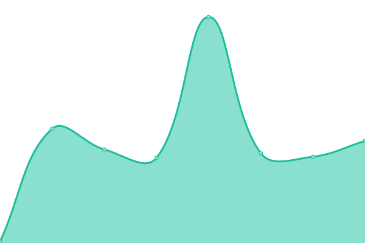
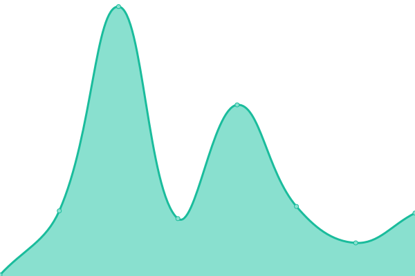
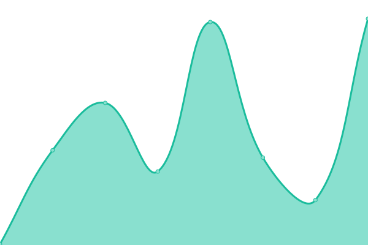
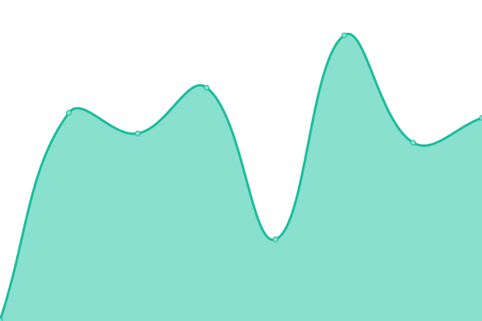
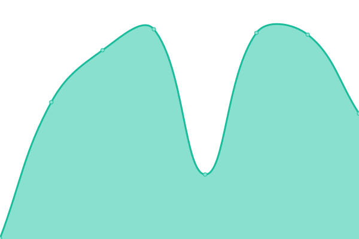

# [📈 Live Status](https://upptime.github.io/upptime): <!--live status--> **🟧 Partial outage**

This repository contains the open-source uptime monitor and status page for [Upptime](https://upptime.js.org), powered by [Upptime](https://github.com/upptime/upptime).

With [Upptime](https://upptime.js.org), you can get your own unlimited and free uptime monitor and status page, powered entirely by a GitHub repository. We use [Issues](https://github.com/upptime/upptime/issues) as incident reports, [Actions](https://github.com/PabloBaeza56/ALERTS_SILVER_RIVER/actions) as uptime monitors, and [Pages](https://upptime.github.io/upptime) for the status page.

<!--start: status pages-->
<!-- This summary is generated by Upptime (https://github.com/upptime/upptime) -->
<!-- Do not edit this manually, your changes will be overwritten -->
<!-- prettier-ignore -->
| URL | Status | History | Response Time | Uptime |
| --- | ------ | ------- | ------------- | ------ |
|  [Google](https://www.google.com) | 🟩 Up | [google.yml](https://github.com/PabloBaeza56/ALERTS_SILVER_RIVER/commits/HEAD/history/google.yml) | 

 79ms
     
 | 

<a href="https://PabloBaeza56.github.io/ALERTS_SILVER_RIVER/history/google">100.00%</a>
    

|  [Github](https://github.com) | 🟩 Up | [github.yml](https://github.com/PabloBaeza56/ALERTS_SILVER_RIVER/commits/HEAD/history/github.yml) | 

 92ms
     
 | 

<a href="https://PabloBaeza56.github.io/ALERTS_SILVER_RIVER/history/github">100.00%</a>
    

|  [Render Host](https://render.com) | 🟩 Up | [render-host.yml](https://github.com/PabloBaeza56/ALERTS_SILVER_RIVER/commits/HEAD/history/render-host.yml) | 

 286ms
     
 | 

<a href="https://PabloBaeza56.github.io/ALERTS_SILVER_RIVER/history/render-host">100.00%</a>
    

|  [Postman](https://community.postman.com) | 🟩 Up | [postman.yml](https://github.com/PabloBaeza56/ALERTS_SILVER_RIVER/commits/HEAD/history/postman.yml) | 

 392ms
     
 | 

<a href="https://PabloBaeza56.github.io/ALERTS_SILVER_RIVER/history/postman">100.00%</a>
    

|  [SILVER_RIVER](https://docker-silver-river.onrender.com/ping) | 🟥 Down | [silver-river.yml](https://github.com/PabloBaeza56/ALERTS_SILVER_RIVER/commits/HEAD/history/silver-river.yml) | 

 320ms
     
 | 

<a href="https://PabloBaeza56.github.io/ALERTS_SILVER_RIVER/history/silver-river">1.37%</a>
    

<!--end: status pages-->

[**Visit our status website →**](https://upptime.github.io/upptime)

## 📄 License

- Powered by: [Upptime](https://github.com/upptime/upptime)
- Code: [MIT](./LICENSE) © [Upptime](https://upptime.js.org)
- Data in the `./history` directory: [Open Database License](https://opendatacommons.org/licenses/odbl/1-0/)
